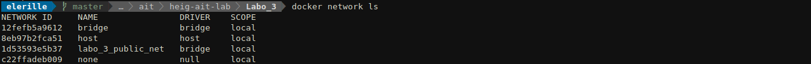

# Labo 3 - Load Balancing

> Auteurs: Gwendoline Dössegger, Noémie Plancherel, Gaby Roch

## Introduction

Dans ce laboratoire, nous allons déployer une applcation web 

TODO !!!!!!!!!!!!!!!!!!!!!!!!!!!!!!!!!!!!!!!!!!!!!!!!!!!!

## Tâches

### 1. Installation des outils

Nous avons déjà installé `Docker` et `Docker-compose` avant le laboratoire. Nous devons uniquement installer `JMeter`.

Nous l'installons directement avec le paquet Debian:

```sh
sudo apt install jmeter 'jmeter-*'
```

Nous allons à présent créer les 3 containers à l'aide de la commande `docker-compose up` qui va se référer au `Dockerfile`

```sh
docker-compose build
# Nous avons dû désactiver un service car le port 80 était déjà occupé
docker-compose up
```

Nous pouvons à présent vérifier que les 3 containers tournent avec la commande:

```sh
docker ps
```


Nous constatons qu'il y a un réseau virtuel qui a été créé pour le labo 3 avec la commande:

```sh
docker network ls
```



Une fois toute la mise en place faite, nous pouvons nous rendre sur le load balancer via l'adresse `http://192.168.42.42`.

En contrôlant, la requête de la page, nous constatons que le `NODESESSID` est bien envoyé à notre navigateur.

#### 1.1

> Explain how the load balancer behaves when you open and refresh the URL http://192.168.42.42 in your browser. Add screenshots to complement your explanations. We expect that you take a deeper a look at session management.

Résultat lorsqu'on se rend sur `http://192.168.42.42` pour la première fois:


Lorsque l'on rafraîchit la page:


On constate qu'il y a une alternance entre les deux serveurs à chaque fois qu'on rafraîchit la page. Le round-robin est utilisé puisque c'est une fois l'un et une fois l'autre. 

Nous remarquons que le `sessionViews` est à 1, peu importe le nombre d'accès au serveur qu'on fait. Cela est dû au fait qu'aucune session n'est créée. 

Nous voyons également que les cookies ne sont pas pris en compte par le load balancing à cette étape. Ceci ne permet donc pas de garder un état entre les connexions dû au fait que le protocole HTTP est un protocole sans état. Il serait possible de maintenir cette connexion à l'aide d'un cookie.

TODO: set-cookie entre serveurs

#### 1.2

> Explain what should be the correct behavior of the load balancer for session management.


pour une session donnée quelque soit le nombre de requête on devrait tombe toujours sur le même serveur pour que les infos de session soient cohérentes et pas resettée à chaque fois

screens coupés du haut avec des cookies envoyés à chaque fois

#### 1.3

> Provide a sequence diagram to explain what is happening when one requests the URL for the first time and then refreshes the page. We want to see what is happening with the cookie. We want to see the sequence of messages exchanged (1) between the browser and HAProxy and (2) between HAProxy and the nodes S1 and S2.

```sequence
participant Browser AS B
participant HaProxy AS H
participant S1 AS S1
participant S2 AS S2
B -> H: GET /\nsans cookie
H -> S1: GET / \n(port 300)\nsans cookie
S1 -> H: JSON \n set cookie: ABC
H -> B:  JSON \n set cookie: ABC
B -> H: GET /\n cookie: ABC
H -> S2: GET / \n(port 300)\n cookie: ABC
S2 -> H: JSON \n set cookie: 123
H -> B:  JSON \n set cookie: 123

```

Nous voyons que les requêtes successives sont envoyées à des serveurs différents (S1 et S2). Mais comme ils ne connaissent pas les sessions de l'un et l'autre, ils recréent des sessions à chaque fois.

#### 1.4

> Provide a screenshot of the summary report from JMeter.


#### 1.5

> Clear the results in JMeter and re-run the test plan. Explain what is happening when only one node remains active. Provide another sequence diagram using the same model as the previous one.

Il envoie des requêtes qu'au serveur actif car HaProxy détecte que S1 est stoppé. S2 ne renvoie donc pas de set cookie car il connait la session reçue (cookie ABC).

```sequence
participant Browser AS B
participant HaProxy AS H
participant S2 AS S2
participant S1 AS S1
B -> H: GET /\nsans cookie
H -> S2: GET / \n(port 300)\nsans cookie
S2 -> H: JSON \n set cookie: ABC
H -> B:  JSON \n set cookie: ABC
B -> H: GET /\n cookie: ABC
H -> S2: GET / \n(port 300)\n cookie: ABC
S2 -> H: JSON \n 
H -> B:  JSON \n 

```


### 2. La persistence des sessions

#### 2.1 

> SERVERID

2 cookies chez le client, pas lié au fonctionnement de l'app node
si node n'utilise pas de cookies c'est le HaProxy qui créera des cookies

```sequence
participant Browser AS B
participant HaProxy AS H
participant S1 AS S2
B -> H: GET /\nsans cookie
H -> S2: GET / \n(port 300)\nsans cookie
S2 -> H: JSON \n set-cookie: NODESESSID=ABC
H -> B:  JSON \n set-cookie: NODESESSID=ABC; SERVERID=S1
B -> H: GET /\n cookie: NODESESSID=ABC; SERVERID=S1
H -> S2: GET / \n(port 300)\n cookie: NODESESSID=ABC
S2 -> H: JSON \n 
H -> B:  JSON \n 

```

```sequence
participant Browser AS B
participant HaProxy AS H
participant S1 AS S2
B -> H: GET /\nsans cookie
H -> S2: GET / \n(port 300)\nsans cookie
S2 -> H: JSON \n set-cookie: NODESESSID=ABC
H -> B:  JSON \n set-cookie: NODESESSID=ABC
B -> H: GET /\n cookie: NODESESSID=ABC
H -> S2: GET / \n(port 300)\n cookie: NODESESSID=ABC
S2 -> H: JSON \n 
H -> B:  JSON \n 

```


peut avoir des soucis

#### 2.2

> Provide the modified `haproxy.cfg` file with a short explanation of the modifications you did to enable sticky session management.

````
//LIGNE DANS fichier config
````

#### 2.3

> Explain what is the behavior when you open and refresh the URL http://192.168.42.42 in your browser. Add screenshots to complement your explanations. We expect that you take a deeper a look at session management.

screenshotss

#### 2.4

> Provide a sequence diagram to explain what is happening when one requests the URL for the first time and then refreshes the page. We want to see what is happening with the cookie. We want to see the sequence of messages exchanged (1) between the browser and HAProxy and (2) between HAProxy and the nodes S1 and S2. We also want to see what is happening when a second browser is used.

```sequence
participant Browser1 AS B
participant Browser2 AS B2
participant HaProxy AS H
participant S1 AS S1
participant S2 AS S2
B -> H: GET /\nsans cookie
H -> S2: GET / \n(port 300)\nsans cookie
S2 -> H: JSON \n set-cookie: NODESESSID=ABC
H -> B:  JSON \n set-cookie: NODESESSID=ABC; SERVERID=S2
B -> H: GET /\n cookie: NODESESSID=ABC; SERVERID=S2
H -> S2: GET / \n(port 300)\n cookie: NODESESSID=ABC
S2 -> H: JSON \n 
H -> B:  JSON \n 
B2 -> H: GET /\nsans cookie
H -> S1: GET / \n(port 300)\nsans cookie
S1 -> H: JSON \n set-cookie: NODESESSID=ABC
H -> B2:  JSON \n set-cookie: NODESESSID=ABC; SERVERID=S1
B2 -> H: GET /\n cookie: NODESESSID=ABC; SERVERID=S1
H -> S1: GET / \n(port 300)\n cookie: NODESESSID=ABC
S1 -> H: JSON \n 
H -> B2:  JSON \n 
```

#### 2.5

> Provide a screenshot of JMeter's summary report. Is there a difference with this run and the run of Task 1?


#### 2.6

> Now, update the JMeter script. Go in the HTTP Cookie Manager and ~~uncheck~~verify that the box `Clear cookies each iteration?` is unchecked.


### 3. Le drainage des connexions

### 4. Le mode dégradé avec Round Robin

### 5. Les stratégies de load balancing

## Conclusion

## Annexes

