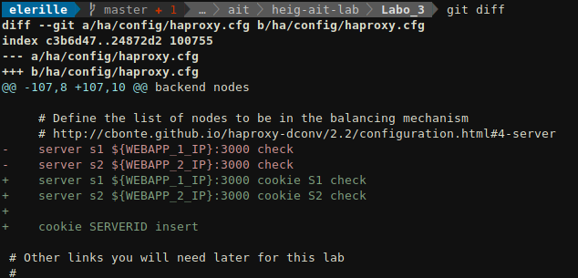
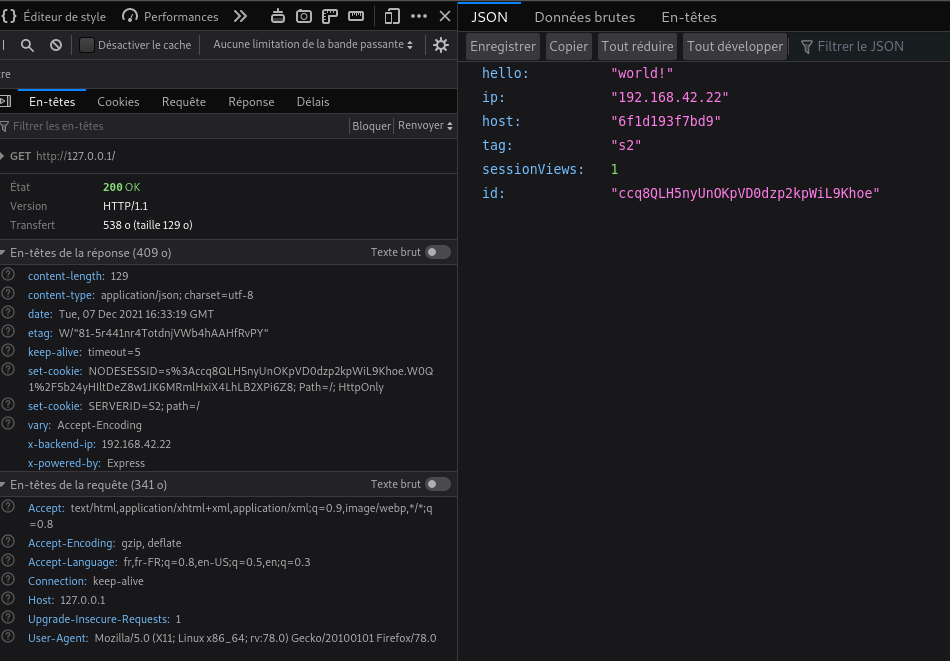
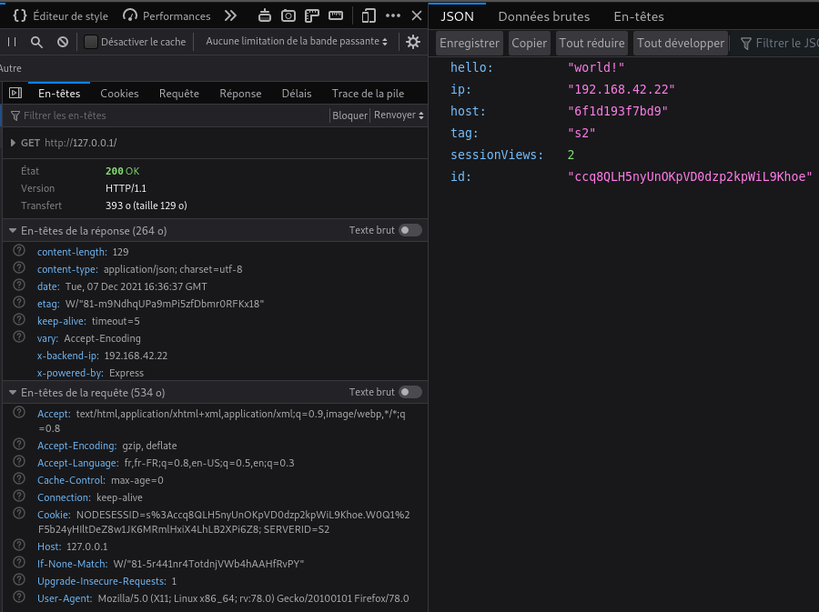
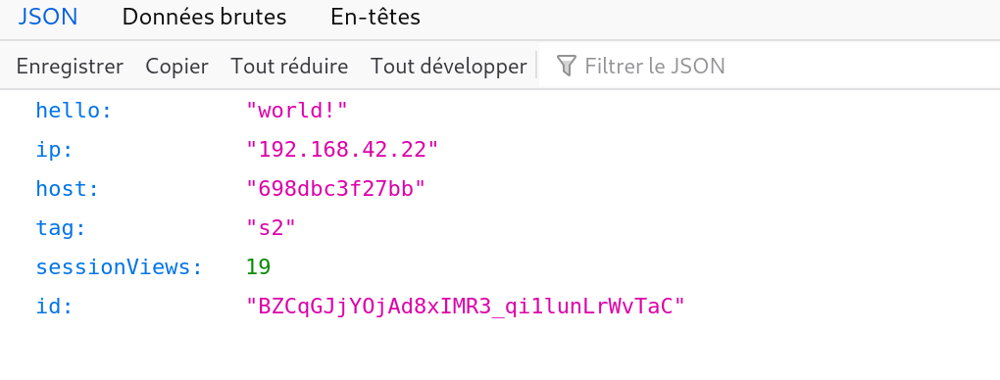
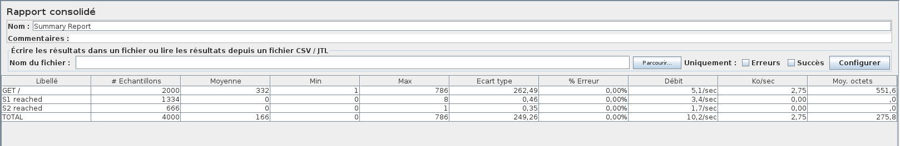
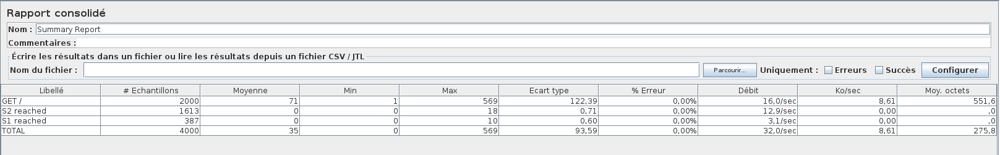
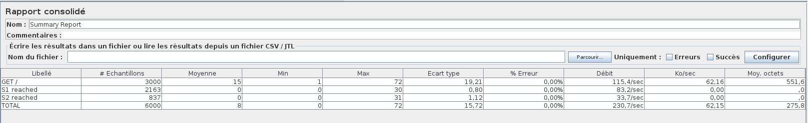
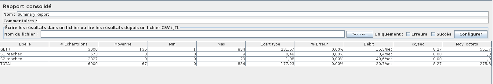

# Labo 3 - Load Balancing

> Auteurs: Gwendoline Dössegger, Noémie Plancherel, Gaby Roch

## Introduction

Dans ce laboratoire, nous allons déployer une applcation web 

TODO !!!!!!!!!!!!!!!!!!!!!!!!!!!!!!!!!!!!!!!!!!!!!!!!!!!!

## Tâches

### 1. Installation des outils

Nous avons déjà installé `Docker` et `Docker-compose` avant le laboratoire. Nous devons uniquement installer `JMeter`.

Nous l'installons directement avec le paquet Debian:

```sh
sudo apt install jmeter 'jmeter-*'
```

Nous allons à présent créer les 3 containers à l'aide de la commande `docker-compose up` qui va se référer au `Dockerfile`

```sh
docker-compose build
# Nous avons dû désactiver un service car le port 80 était déjà occupé
docker-compose up
```

Nous pouvons à présent vérifier que les 3 containers tournent avec la commande:

```sh
docker ps
```


Nous constatons qu'il y a un réseau virtuel qui a été créé pour le labo 3 avec la commande:

```sh
docker network ls
```


Une fois toute la mise en place faite, nous pouvons nous rendre sur le load balancer via l'adresse `http://192.168.42.42`.

En contrôlant, la requête de la page, nous constatons que le `NODESESSID` est bien envoyé à notre navigateur.

#### 1.1

> Explain how the load balancer behaves when you open and refresh the URL http://192.168.42.42 in your browser. Add screenshots to complement your explanations. We expect that you take a deeper a look at session management.

Résultat lorsqu'on se rend sur `http://192.168.42.42` pour la première fois:


Lorsque l'on rafraîchit la page:


On constate qu'il y a une alternance entre les deux serveurs à chaque fois qu'on rafraîchit la page. Le round-robin est utilisé puisque c'est une fois l'un et une fois l'autre. 

Nous remarquons que le `sessionViews` est à 1, peu importe le nombre d'accès au serveur qu'on fait. Cela est dû au fait qu'aucune session n'est créée. 

Nous voyons également que les cookies ne sont pas pris en compte par le load balancing à cette étape. Ceci ne permet donc pas de garder un état entre les connexions dû au fait que le protocole HTTP est un protocole sans état. Il serait possible de maintenir cette connexion à l'aide d'un cookie.

TODO: set-cookie entre serveurs

#### 1.2

> Explain what should be the correct behavior of the load balancer for session management.


pour une session donnée quelque soit le nombre de requête on devrait tombe toujours sur le même serveur pour que les infos de session soient cohérentes et pas resettée à chaque fois

screens coupés du haut avec des cookies envoyés à chaque fois

#### 1.3

> Provide a sequence diagram to explain what is happening when one requests the URL for the first time and then refreshes the page. We want to see what is happening with the cookie. We want to see the sequence of messages exchanged (1) between the browser and HAProxy and (2) between HAProxy and the nodes S1 and S2.

```sequence
participant Browser AS B
participant HaProxy AS H
participant S1 AS S1
participant S2 AS S2
B -> H: GET /\nsans cookie
H -> S1: GET / \n(port 300)\nsans cookie
S1 -> H: JSON \n set cookie: ABC
H -> B:  JSON \n set cookie: ABC
B -> H: GET /\n cookie: ABC
H -> S2: GET / \n(port 300)\n cookie: ABC
S2 -> H: JSON \n set cookie: 123
H -> B:  JSON \n set cookie: 123

```

Nous voyons que les requêtes successives sont envoyées à des serveurs différents (S1 et S2). Mais comme ils ne connaissent pas les sessions de l'un et l'autre, ils recréent des sessions à chaque fois.

#### 1.4

> Provide a screenshot of the summary report from JMeter.


#### 1.5

> Clear the results in JMeter and re-run the test plan. Explain what is happening when only one node remains active. Provide another sequence diagram using the same model as the previous one.

Il envoie des requêtes qu'au serveur actif car HaProxy détecte que S1 est stoppé. S2 ne renvoie donc pas de set cookie car il connait la session reçue (cookie ABC).

```sequence
participant Browser AS B
participant HaProxy AS H
participant S2 AS S2
participant S1 AS S1
B -> H: GET /\nsans cookie
H -> S2: GET / \n(port 300)\nsans cookie
S2 -> H: JSON \n set cookie: ABC
H -> B:  JSON \n set cookie: ABC
B -> H: GET /\n cookie: ABC
H -> S2: GET / \n(port 300)\n cookie: ABC
S2 -> H: JSON \n 
H -> B:  JSON \n 

```


### 2. La persistence des sessions

#### 2.1 

> SERVERID

2 cookies chez le client, pas lié au fonctionnement de l'app node
si node n'utilise pas de cookies c'est le HaProxy qui créera des cookies

```sequence
participant Browser AS B
participant HaProxy AS H
participant S1 AS S2
B -> H: GET /\nsans cookie
H -> S2: GET / \n(port 300)\nsans cookie
S2 -> H: JSON \n set-cookie: NODESESSID=ABC
H -> B:  JSON \n set-cookie: NODESESSID=ABC; SERVERID=S1
B -> H: GET /\n cookie: NODESESSID=ABC; SERVERID=S1
H -> S2: GET / \n(port 300)\n cookie: NODESESSID=ABC
S2 -> H: JSON \n 
H -> B:  JSON \n 

```

```sequence
participant Browser AS B
participant HaProxy AS H
participant S1 AS S2
B -> H: GET /\nsans cookie
H -> S2: GET / \n(port 300)\nsans cookie
S2 -> H: JSON \n set-cookie: NODESESSID=ABC
H -> B:  JSON \n set-cookie: NODESESSID=ABC
B -> H: GET /\n cookie: NODESESSID=ABC
H -> S2: GET / \n(port 300)\n cookie: NODESESSID=ABC
S2 -> H: JSON \n 
H -> B:  JSON \n 

```


peut avoir des soucis

#### 2.2

> Provide the modified `haproxy.cfg` file with a short explanation of the modifications you did to enable sticky session management.

````sh
# Define the list of nodes to be in the balancing mechanism
# http://cbonte.github.io/haproxy-dconv/2.2/configuration.html#4-server
server s1 ${WEBAPP_1_IP}:3000 cookie S1 check
server s2 ${WEBAPP_2_IP}:3000 cookie S2 check

cookie SERVERID insert
````




#### 2.3

> Explain what is the behavior when you open and refresh the URL http://192.168.42.42 in your browser. Add screenshots to complement your explanations. We expect that you take a deeper a look at session management.


screenshotss








#### 2.4

> Provide a sequence diagram to explain what is happening when one requests the URL for the first time and then refreshes the page. We want to see what is happening with the cookie. We want to see the sequence of messages exchanged (1) between the browser and HAProxy and (2) between HAProxy and the nodes S1 and S2. We also want to see what is happening when a second browser is used.

```sequence
participant Browser1 AS B
participant Browser2 AS B2
participant HaProxy AS H
participant S1 AS S1
participant S2 AS S2
B -> H: GET /\nsans cookie
H -> S2: GET / \n(port 300)\nsans cookie
S2 -> H: JSON \n set-cookie: NODESESSID=ABC
H -> B:  JSON \n set-cookie: NODESESSID=ABC; SERVERID=S2
B -> H: GET /\n cookie: NODESESSID=ABC; SERVERID=S2
H -> S2: GET / \n(port 300)\n cookie: NODESESSID=ABC
S2 -> H: JSON \n 
H -> B:  JSON \n 
B2 -> H: GET /\nsans cookie
H -> S1: GET / \n(port 300)\nsans cookie
S1 -> H: JSON \n set-cookie: NODESESSID=ABC
H -> B2:  JSON \n set-cookie: NODESESSID=ABC; SERVERID=S1
B2 -> H: GET /\n cookie: NODESESSID=ABC; SERVERID=S1
H -> S1: GET / \n(port 300)\n cookie: NODESESSID=ABC
S1 -> H: JSON \n 
H -> B2:  JSON \n 
```

#### 2.5

> Provide a screenshot of JMeter's summary report. Is there a difference with this run and the run of Task 1?
>
> Now, update the JMeter script. Go in the HTTP Cookie Manager and ~~uncheck~~verify that the box `Clear cookies each iteration?` is unchecked.


#### 2.7

> Provide a screenshot of JMeter's summary report. Give a short explanation of what the load balancer is doing.


### 3. Le drainage des connexions

#### 3.1

> Take a screenshot of step 5 and tell us which node is answering.



encadré s1 + s2 nodes + state


#### 3.2

> Based on your previous answer, set the node in DRAIN mode. Take a screenshot of the HAProxy state page.

```sh
set server nodes/s2 state drain
```


#### 3.3

> Refresh your browser and explain what is happening. Tell us if you stay on the same node or not. If yes, why? If not, why?

Nous sommes toujours sur le même noeud car le cookie nous indique que nous devons aller sur ce noeud (`s2`) et donc HAProxy nous laisse communiquer avec le `s2`. 


Drain : explain


#### 3.4

> Open another browser and open `http://192.168.42.42`. What is happening?

Nous sommes sur le s1 car c'est une nouvelle connexion.


#### 3.5

> Clear the cookies on the new browser and repeat these two steps multiple times. What is happening? Are you reaching the node in DRAIN mode?


On se retrouve de nouveau sur le s1 ce qui est normal. => expliquer pq


#### 3.6

> Reset the node in READY mode. Repeat the three previous steps and explain what is happening. Provide a screenshot of HAProxy's stats page.


Après avoir supprimé les cookies sur les deux navigateurs :

- Firefox : après refresh, on reste sur s2
  - pourquoi :
- Chrome :  
  - comment : chrome obtient une session vers un des noeuds, on a une chance sur deux de tomber sur 1 et une chance sur deux de tomber sur 2. => car round-robin. On était tombé sur s1
  - après, clear cookies : cette fois-ci on tombe sur s2
  - sur s1 après clear
  - sur s2 après clear
  - CAR round-robin


#### 3.7

> Finally, set the node in MAINT mode. Redo the three same steps and explain what is happening. Provide a screenshot of HAProxy's stats page.


- Firefox : refresh : on a été placé sur le s1 alors que de base on était sur le s2

- chrome : refresh, on est toujours sur s1
  - après supp cookies, on est toujours sur s1
  - après supp cookies, one st encore et toujorus sur s1


### 4. Le mode dégradé avec Round Robin

#### 4.1

> Make sure a delay of 0 milliseconds is set on `s1`. Do a run to have a baseline to compare with in the next experiments.

on envoie une requête POST avec un delay de 0 milliseconds pour être sûr qu'on a rien de configuràé sur S1. On le fait également pour S2.

```sh
curl -H "Content-Type: application/json" -X POST -d '{"delay": 0}' http://192.168.42.11:3000/delay
curl -H "Content-Type: application/json" -X POST -d '{"delay": 0}' http://192.168.42.22:3000/delay
```


#### 4.2

> Set a delay of 250 milliseconds on `s1`. Relaunch a run with the JMeter script and explain what is happening.

```sh
curl -H "Content-Type: application/json" -X POST -d '{"delay": 250}' http://192.168.42.11:3000/delay
# résultat
{"message":"New timeout of 250ms configured."} 
```


Nous n'avons pas attendu que S1 effectue ses 1000 requêtes car cela nous aurait pris trop de temps d'attendre la fin du rapport.

Nous constatons effectivement que S1 effectue des requêtes toutes les 250 millisecondes. Nous remarquons également qu'il n'y pas eu d'erreurs lors du test malgré la lenteur de notre service.

#### 4.3

> Set a delay of 2500 milliseconds on `s1`. Same than previous step.

```sh
curl -H "Content-Type: application/json" -X POST -d '{"delay": 2500}' http://192.168.42.11:3000/delay
# résultat
{"message":"New timeout of 2500ms configured."} 
```


Nous voyons que S1 a uniquement effectué 2 requêtes car il avait un temps de réponse relativement lent et que HAProxy a redirigé les requêtes vers S2.

#### 4.4

> In the two previous steps, are there any errors? Why?

Nous constatons que pour l'étape 2, avec un delay de 250ms, il y a 0.08% d'erreur pour les requêtes ce qui correspond à une requête échouée lorsqu'on a cliqué sur le bouton stop et que la réponse n'était pas encore arrivée.

#### 4.5

> Update the HAProxy configuration to add a weight to your nodes. For that, add `weight [1-256]` where the value of weight is between the two values (inclusive). Set `s1` to 2 and `s2` to 1. Redo a run with a 250ms delay.

```sh
    # Define the list of nodes to be in the balancing mechanism
    # http://cbonte.github.io/haproxy-dconv/2.2/configuration.html#4-server
    server s1 ${WEBAPP_1_IP}:3000 cookie S1 check weight 2
    server s2 ${WEBAPP_2_IP}:3000 cookie S2 check weight 1
```


#### 4.6

> Now, what happens when the cookies are cleared between each request and the delay is set to 250ms? We expect just one or two sentence to summarize your observations of the behavior with/without cookies.

> Rapport sans les cookies



Nous remarquons donc qu'en nettoyant les cookies entre chaque requêtes, 2/3 des requêtes vont sur S1 et le tiers restant sur S2, on peut expliquer cela avec le fait que S1 a un poids de 2 et S2 un poids de 1, donc S1 reçoit logiquement 2x plus de requêtes que S2. Alors qu'avec les cookies, chaque serveur reçoit 1000 requêtes car lorsqu'un client est connecté à un noeud, il y restera connecté jusqu'à la fin du test (malgré la lenteur du service). 


### 5. Les stratégies de load balancing

#### 5.1

> Briefly explain the strategies you have chosen and why you have chosen them.

> leastconn

La stratégie `leastconn` permet au serveur qui a le moins de connexions, de recevoir la nouvelle connexion.  Elle utilise round-robin dans le cas où la charge est égale sur tous les serveurs pour s'assurer qu'ils seront tous utilisés. L'algorithme est dynamique dans le sens où les poids des serveurs seront ajustés en fonction du nombre de connexions actives.

Nous avons décidé de choisir cette stratégie car elle peut être intéressante lors d'ajout de delay sur un serveur.

> first

La stratégie `first` permet à un serveur qui a des slots de connexions de libre, de recevoir la nouvelle connexion. Le serveur est choisi en fonction de son id de manière croissante. Dès qu'un serveur atteint son nombre maximum de connexion (`maxconn`), c'est le serveur suivant qui sera utilisé. Le but de cet algorithme c'est d'optimiser le nombre de serveurs utilisés.

Nous avons décidé d'utiliser cette stratégie car il permet d'éteindre les serveurs avec des grands id lorsqu'il y a peu de charge sur l'application.

#### 5.2

> Provide evidence that you have played with the two strategies (configuration done, screenshots, ...)

> leastconn

Configuration dans HAProxy

```sh
    # Define the balancing policy
    # http://cbonte.github.io/haproxy-dconv/2.2/configuration.html#balance
    balance leastconn
```

> Nettoyage des cookies, sans delay


S2 a un peu plus travaillé que S1, car à un moment donné S1 devait être un peu plus chargé que S2, mais de manière générale la charge est répartie de manière égale.

> Nettoyage des cookies, delay de 250ms sur S1



Nous pouvons constater que S1 étant plus lent à répondre, il a donc traité moins de requêtes.

> Nettoyage des cookies, delay de 2500ms sur S1


Nous pouvons constater que S1 étant plus lent à répondre, il a donc traité moins de requêtes.

> first

Configuration dans HAProxy

```sh
    # Define the balancing policy
    # http://cbonte.github.io/haproxy-dconv/2.2/configuration.html#balance
    balance first
    # Define the list of nodes to be in the balancing mechanism
    # http://cbonte.github.io/haproxy-dconv/2.2/configuration.html#4-server
    server s1 ${WEBAPP_1_IP}:3000 cookie S1 check maxconn 2
    server s2 ${WEBAPP_2_IP}:3000 cookie S2 check maxconn 2
```

> Nettoyage des cookies, sans delay, avec 2 threads


Nous avons configuré JMeter pour utiliser 2 threads et vu que HAProxy est configuré pour avoir 2 connexions par serveur, nous tombons que sur S1 car à aucun moment nous avons suffisament de connexions ouvertes pour que HAProxy nous envoie sur S2.

> Nettoyage des cookies, sans delay, avec 3 threads



En ayant configuré JMeter avec 3 threads, nous voyons que HAProxy redirige à peu près 1/3 des connexions sur S2. Nous constatons que c'est en dessous de 1/3 car il y a certainement des moments de vide lors des requêtes que fait JMeter et donc HAProxy repasse sur deux serveurs.

> Nettoyage des cookies, avec un delay de 250ms sur S1, avec 3 threads



Nous remarquons que 1/5 des requêtes sont envoyées sur S1, alors que nous avons que 3 threads et que S1 traite deux requêtes en parallèle. Malgré que S1 soit lent, nous voyons que notre service est encore passablement rapide pour une grande majorité des utilisateurs.

#### 5.3

> Compare the two strategies and conclude which is the best for this lab (not necessary the best at all).

En comparant tous les tests qu'on a effectué, nous remarquons que `first`  est la meilleures stratégie pour ce laboratoire car il permet de faire en sorte d'aligner la charge d'un serveur en fonction de sa capacité calculée en amont et de permettre d'éteindre les serveurs non-utilisés. 

## Conclusion

TODO!!!!!!!!!!!!!!!!!!!!!!!

## Annexes

https://d2c.io/post/haproxy-load-balancer-part-2-backend-section-algorithms

http://cbonte.github.io/haproxy-dconv/configuration-1.6.html#balance
