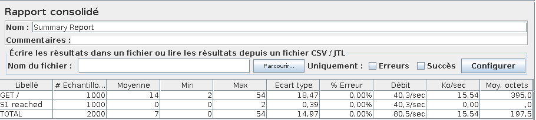

# Labo 3 - Load Balancing

> Auteurs: Gwendoline Dössegger, Noémie Plancherel, Gaby Roch

## Introduction

Dans ce laboratoire, nous allons effectuer plusieurs tâches concernant le load balancing; nous prendrons connaissance du fonctionnement de HAProxy.

De plus, nous utiliserons JMeter afin de tester l'application.

## Tâches

### 1. Installation des outils

Nous avons déjà installé `docker` et `docker-compose` avant le laboratoire. Nous devons uniquement installer `JMeter`.

Nous l'installons directement avec le paquet Debian:

```sh
sudo apt install jmeter 'jmeter-*'
```

Nous allons à présent créer les 3 containers à l'aide de la commande `docker-compose up` qui va se référer au `Dockerfile`

```sh
docker-compose build
# Nous avons dû désactiver un service car le port 80 était déjà occupé
sudo systemctl stop apache2.service
docker-compose up
```

Nous pouvons à présent vérifier que les 3 containers tournent avec la commande:

```sh
docker ps
```


Nous constatons qu'il y a un réseau virtuel qui a été créé pour le labo 3 avec la commande:

```sh
docker network ls
```


Une fois toute la mise en place faite, nous pouvons nous rendre sur le load balancer via l'adresse `http://192.168.42.42`.

En contrôlant, la requête de la page, nous constatons que le `NODESESSID` est bien envoyé à notre navigateur.


#### 1.1

> Explain how the load balancer behaves when you open and refresh the URL http://192.168.42.42 in your browser. Add screenshots to complement your explanations. We expect that you take a deeper a look at session management.

Résultat lorsqu'on se rend sur `http://192.168.42.42` pour la première fois:


Lorsque l'on rafraîchit la page:


On constate qu'il y a une alternance entre les deux serveurs à chaque fois qu'on rafraîchit la page. Le **round-robin** est utilisé puisque c'est une fois l'un et une fois l'autre. 

Nous remarquons que le `sessionViews` est à 1, peu importe le nombre d'accès au serveur qu'on fait. Cela est dû au fait qu'aucune session n'est créée. 

Nous voyons également que les cookies ne sont pas pris en compte par le load balancing à cette étape. Ceci ne permet donc pas de garder un état entre les connexions dû au fait que le protocole HTTP est un protocole sans état. 


#### 1.2

> Explain what should be the correct behavior of the load balancer for session management.

Si on prend en compte les sessions, quelque soit le nombre de requêtes que l'on fait sur le HAProxy, on communiquera toujours avec le même serveur. Ceci permettra que les informations de sessions soient cohérentes et pas réinitialisées à chaque requête.

De plus, l'attribut `sessionViews` sera incrémenté à chaque requête.


#### 1.3

> Provide a sequence diagram to explain what is happening when one requests the URL for the first time and then refreshes the page. We want to see what is happening with the cookie. We want to see the sequence of messages exchanged (1) between the browser and HAProxy and (2) between HAProxy and the nodes S1 and S2.

```sequence
participant Browser AS B
participant HaProxy AS H
participant S1 AS S1
participant S2 AS S2
B -> H: GET / \n 192.168.42.42\nsans cookie
H -> S1: GET / \n192.168.42.11:3000\nsans cookie
S1 -> H: JSON \n set cookie: ABC
H -> B:  JSON \n set cookie: ABC
B -> H: GET / \n 192.168.42.42\n cookie: ABC
H -> S2: GET / \n192.168.42.22:3000\n cookie: ABC
S2 -> H: JSON \n set cookie: 123
H -> B:  JSON \n set cookie: 123

```

Nous voyons que les requêtes successives sont envoyées à des serveurs différents (S1 et S2). Mais comme ils ne connaissent pas les sessions de l'un et l'autre, ils recréent des sessions à chaque fois avec un `set-cookie`.


#### 1.4

> Provide a screenshot of the summary report from JMeter.


Ainsi, on voit que les requêtes sont envoyées alternativement aux serveurs S1 et S2. Chaque serveur reçoit un nombre égal de requêtes.


#### 1.5

> Clear the results in JMeter and re-run the test plan. Explain what is happening when only one node remains active. Provide another sequence diagram using the same model as the previous one.

Nous avons premièrement stoppé le serveur S1:

```sh
docker stop s1
```

Ainsi, HAProxy envoie des requêtes qu'au serveur actif , S2, car il détecte que S1 est stoppé. S2 ne renvoie donc pas de `set-cookie` car il connait la session reçue (cookie ABC).

```sequence
participant Browser AS B
participant HaProxy AS H
participant S2 AS S2
participant S1 AS S1
B -> H: GET / \n 192.168.42.42\nsans cookie
H -> S2: GET / \n 192.168.42.22:3000\nsans cookie
S2 -> H: JSON \n set cookie: ABC
H -> B:  JSON \n set cookie: ABC
B -> H: GET /\n 192.168.42.42\n cookie: ABC
H -> S2: GET / \n 192.168.42.22:3000\n cookie: ABC
S2 -> H: JSON \n 
H -> B:  JSON \n 

```


Nous remarquons effectivement que les tests ne sont effectués que sur S2.


### 2. La persistence des sessions

#### 2.1 

> There is different way to implement the sticky session. One possibility  is to use the SERVERID provided by HAProxy. Another way is to use the  NODESESSID provided by the application. Briefly explain the difference  between both approaches (provide a sequence diagram with cookies to show the difference).

> SERVERID

Nous voyons sur le diagramme ci-dessous, que le client possède deux cookies différents:

- `NODESSESSID` qui est lié à l'application
- `SERVERID` qui identifie le noeud et qui est défini par le HAProxy. Il n'est pas lié à l'application et donc il fonctionne quelque soit l'application.

```sequence
participant Browser AS B
participant HaProxy AS H
participant S1 AS S2
B -> H: GET /\n 192.168.42.42\nsans cookie
H -> S2: GET / \n 192.168.42.11:3000\nsans cookie
S2 -> H: JSON \n set-cookie: NODESESSID=ABC
H -> B:  JSON \n set-cookie: NODESESSID=ABC; SERVERID=S1
B -> H: GET /\n 192.168.42.42\n cookie: NODESESSID=ABC; SERVERID=S1
H -> S2: GET / \n\n 192.168.42.11:3000\n cookie: NODESESSID=ABC
S2 -> H: JSON \n 
H -> B:  JSON \n 

```

> NODESESSID

Lors de l'utilisation de `NODESESSID`, nous ne configurons plus qu'un cookie qui est directement lié à notre application. Il pourrait y avoir un souci si l'application déciderait de modifier le cookie et que HAProxy n'arrive pas à detecter la modification. HAProxy ne saurait plus vers quel serveur il doit envoyer la requête, donc il pourrait avoir un problème avec la session.

Lors de l'utilisation de cet unique cookie, HAProxy sait vers quel serveur rediriger les requêtes car il garde une table de mapping en interne.

```sequence
participant Browser AS B
participant HaProxy AS H
participant S1 AS S2
B -> H: GET /\n 192.168.42.42\nsans cookie
H -> S2: GET / \n\n 192.168.42.11:3000\nsans cookie
S2 -> H: JSON \n set-cookie: NODESESSID=ABC
H -> B:  JSON \n set-cookie: NODESESSID=ABC
B -> H: GET /\n 192.168.42.42\n cookie: NODESESSID=ABC
H -> S2: GET /\n 192.168.42.11:3000\n cookie: NODESESSID=ABC
S2 -> H: JSON \n 
H -> B:  JSON \n 

```

#### 2.2

> Provide the modified `haproxy.cfg` file with a short explanation of the modifications you did to enable sticky session management.

````sh
# Define the list of nodes to be in the balancing mechanism
# http://cbonte.github.io/haproxy-dconv/2.2/configuration.html#4-server
server s1 ${WEBAPP_1_IP}:3000 cookie S1 check
server s2 ${WEBAPP_2_IP}:3000 cookie S2 check

cookie SERVERID insert
````

Nous avons modifié le fichier de configuration de HAProxy afin de configurer le sticky session. Pour cela, nous avons ajouté un paramètre, `cookie S1` et `cookie S2`, sur chaque noeud de la liste afin de lui ajouter un cookie.

Puis nous avons ajouté une ligne qui précise que les cookies utilisés sont de type `SERVERID` et le paramètre `insert` permet d'ajouter un cookie s'il n'existe pas.

Ainsi, pour la suite des manipulations, nous utiliserons l'approche `SERVERID`.


#### 2.3

> Explain what is the behavior when you open and refresh the URL http://192.168.42.42 in your browser. Add screenshots to complement your explanations. We expect that you take a deeper a look at session management.

Nous constatons que lors de la première requête, nous sommes redirigés sur le S2 et nous pouvons voir que dans la réponse il y a les deux cookies, `NODESSESSID` et `SERVERID`. Pour le second cookie, nous voyons que sa valeur est `S2`, ce qui est correct. 


Lorsque l'on rafraîchit la page, nous sommes également redirigés vers le serveur S2. Nous constatons que le `sessionViews` est incrémenté de 1. Le comportement est celui attendu car grâce aux cookies, nous gardons la même session.

De plus, nous voyons que dans la requête, le cookie `NODESSESSID` reçu lors de la première requête, est envoyé vers le serveur afin d'indiquer l'id de la session.


#### 2.4

> Provide a sequence diagram to explain what is happening when one requests the URL for the first time and then refreshes the page. We want to see what is happening with the cookie. We want to see the sequence of messages exchanged (1) between the browser and HAProxy and (2) between HAProxy and the nodes S1 and S2. We also want to see what is happening when a second browser is used.

```sequence
participant Browser1 AS B
participant Browser2 AS B2
participant HaProxy AS H
participant S1 AS S1
participant S2 AS S2
B -> H: GET /\n 192.168.42.42\nsans cookie
H -> S2: GET / \n 192.168.42.22:3000\nsans cookie
S2 -> H: JSON \n set-cookie: NODESESSID=ABC
H -> B:  JSON \n set-cookie: NODESESSID=ABC; SERVERID=S2
B -> H: GET /\n 192.168.42.42\n cookie: NODESESSID=ABC; SERVERID=S2
H -> S2: GET / \n 192.168.42.22:3000\n cookie: NODESESSID=ABC
S2 -> H: JSON \n 
H -> B:  JSON \n 
B2 -> H: GET /\n 192.168.42.42\nsans cookie
H -> S1: GET / \n\n 192.168.42.11:3000\nsans cookie
S1 -> H: JSON \n set-cookie: NODESESSID=ABC
H -> B2:  JSON \n set-cookie: NODESESSID=ABC; SERVERID=S1
B2 -> H: GET /\n 192.168.42.42\n cookie: NODESESSID=ABC; SERVERID=S1
H -> S1: GET / \n 192.168.42.11:3000\n cookie: NODESESSID=ABC
S1 -> H: JSON \n 
H -> B2:  JSON \n 
```


#### 2.5

> Provide a screenshot of JMeter's summary report. Is there a difference with this run and the run of Task 1?
>



Nous remarquons que toutes les requêtes atteignent le serveur S1 alors que dans la task 1 les requêtes étaient partagés entre les serveurs S1 et S2 dû à la configuration du round-robin. Nous pouvons expliquer cette différence avec le fait que pour cette tâche, le serveur S1 est configuré avec des sticky sessions et donc les requêtes du navigateur seront toujours redirigées vers S1.


#### 2.7

> Now, update the JMeter script. Go in the HTTP Cookie Manager and ~~uncheck~~verify that the box `Clear cookies each iteration?` is unchecked.
>
> Go in `Thread Group` and update the `Number of threads`. Set the value to 2.
>
> Provide a screenshot of JMeter's summary report. Give a short explanation of what the load balancer is doing.


Nous voyons que le premier thread sera assigné à un serveur grâce à un cookie et il sera toujours redirigé dessus. Le second thread est assigné au deuxième serveur et il restera également dessus. 


### 3. Le drainage des connexions

#### 3.1

> Take a screenshot of step 5 and tell us which node is answering.

Nous avons rafraîchit la page plusieurs fois, 18 fois,  et nous constatons que le noeud qui répond est le serveur S2.


Nous constatons que les deux serveurs sont UP et que nous avons une session sur S2.


#### 3.2

> Based on your previous answer, set the node in DRAIN mode. Take a screenshot of the HAProxy state page.

Afin de configurer le mode `DRAIN` sur S2, on exécute cette commande avec `socat`:

```sh
> set server nodes/s2 state drain
```

Nous voyons qu'en bleu foncé sur la capture ci-dessous, le serveur S2 est bien en mode `DRAIN`.


#### 3.3

> Refresh your browser and explain what is happening. Tell us if you stay on the same node or not. If yes, why? If not, why?

Nous sommes toujours sur le même noeud car le cookie nous indique que nous devons aller sur ce noeud (`s2`) et donc HAProxy nous laisse communiquer avec le `s2`. 

Ce comportement est expliqué par le mode `DRAIN` car étant donné qu'on a configuré le serveur S2 dans ce mode et qu'on avait déjà une session liée à ce serveur, on est toujours redirigé sur ce dernier. Par contre, le nouveau trafic sera redirigé sur S1.


#### 3.4

> Open another browser and open `http://192.168.42.42`. What is happening?

Nous sommes sur le S1 car c'est une nouvelle connexion et qu'on avait encore aucune session.


#### 3.5

> Clear the cookies on the new browser and repeat these two steps multiple times. What is happening? Are you reaching the node in DRAIN mode?

On se retrouve de nouveau sur le S1 ce qui est normal car nous n'avons plus de cookie `SERVEID` lié au S2. De ce fait, nous ne pouvons plus atteindre S2, qui est le noeud configuré en mode `DRAIN`.


#### 3.6

> Reset the node in READY mode. Repeat the three previous steps and explain what is happening. Provide a screenshot of HAProxy's stats page.

Nous avons exécuté la commande suivante:

```sh
> set server nodes/s2 state ready
```

Nous voyons sur la capture ci-dessous que les deux serveurs sont UP et que le serveur S2 n'est plus configuré en mode `DRAIN`.


Nous avons tout d'abord utilisé Firefox pour faire les premières étapes; lors de la première connexion, on est redirigé sur le serveur S2. Une fois la page rafraîchie, on reste sur S2. Ceci est dû aux cookies.

Dans un second temps, nous avons utilisé un autre navigateur et nous avons été redirigés sur S1. Nous avions une chance sur deux de tomber sur le serveur S1 dû au round-robin.

Nous avons ensuite nettoyer les cookies du second navigateur et rafraîchit la page, nous avons atteint le serveur S2 car le navigateur n'avait aucune session active. En répétant la manipulation plusieurs fois, nous sommes tombés en alternance sur S1 puis sur S2 étant donné que HAProxy est configuré en mode round-robin. 


#### 3.7

> Finally, set the node in MAINT mode. Redo the three same steps and explain what is happening. Provide a screenshot of HAProxy's stats page.

Nous avons exécuté la commande suivante:

```sh
> set server nodes/s2 state maint
```

Nous voyons sur la capture ci-dessous que les deux serveurs sont UP et que le serveur S2 est configuré en mode `MAINT`.


Nous avons tout d'abord utilisé Firefox pour faire les premières étapes; la session déjà existante qui pointait sur S2, une fois rafraîchie, a été redirigé vers S1 qui est le seul serveur actif.

Dans un second temps, nous avons utilisé un autre navigateur et nous sommes directement dirigés sur S1. 

Peu importe le nombre de rafraîchissements et du nombre de cookies, toutes les requêtes sont redirigées vers S1 dû au fait que le serveur S2 est configuré en mode `MAINT` et que tout le nouveau et actuel trafic est redirigé vers les autres noeuds actifs.


### 4. Le mode dégradé avec Round Robin

#### 4.1

> Make sure a delay of 0 milliseconds is set on `s1`. Do a run to have a baseline to compare with in the next experiments.

On envoie une requête POST avec un delay de 0 milliseconde pour s'assurer qu'on n'a rien de configuré sur S1. On le fait également pour S2.

```sh
curl -H "Content-Type: application/json" -X POST -d '{"delay": 0}' http://192.168.42.11:3000/delay
curl -H "Content-Type: application/json" -X POST -d '{"delay": 0}' http://192.168.42.22:3000/delay
```


Nous voyons dans le rapport JMeter que HAProxy fonctionne normalement et envoie les requêtes en alternance sur les serveurs S1 et S2.


#### 4.2

> Set a delay of 250 milliseconds on `s1`. Relaunch a run with the JMeter script and explain what is happening.

Nous ajoutons un délai de 250 millisecondes sur le serveur S1 en utilisant la commande `curl`:

```sh
curl -H "Content-Type: application/json" -X POST -d '{"delay": 250}' http://192.168.42.11:3000/delay
# Résultat
{"message":"New timeout of 250ms configured."} 
```


Nous n'avons pas attendu que S1 effectue ses 1000 requêtes car cela nous aurait pris trop de temps d'attendre la fin du rapport.

Nous constatons effectivement que S1 effectue des requêtes toutes les 250 millisecondes. Nous nous retrouvons avec une moyenne de `3.2 - 3.3` requêtes par secondes alors que le nombre de requêtes par secondes de `S2` est beaucoup plus élevé. Aussi, nous remarquons également qu'il n'y pas eu d'erreur lors du test malgré la lenteur de notre service. Les requêtes ont été transmises entre le S1 et S2.


#### 4.3

> Set a delay of 2500 milliseconds on `s1`. Same than previous step.

Nous ajoutons un délai de 2500 millisecondes sur le serveur S1 en utilisant la commande `curl`:

```sh
curl -H "Content-Type: application/json" -X POST -d '{"delay": 2500}' http://192.168.42.11:3000/delay
# Résultat
{"message":"New timeout of 2500ms configured."} 
```


Nous voyons que S1 a uniquement effectué 2 requêtes car il avait un temps de réponse relativement lent. Le load balancer redirgie vers les différents serveurs en fonction de leur état. Ici, le S1 étant plus lent, HAProxy a redirigé toutes les autres requêtes vers S2.


#### 4.4

> In the two previous steps, are there any errors? Why?

Nous constatons que pour l'étape 2, avec un délai de 250 millisecondes, il y a 0.08% d'erreur pour les requêtes du serveur S1 ce qui correspond à une requête échouée lorsqu'on a cliqué sur le bouton stop et que la réponse n'était pas encore arrivée. Sans cette erreur de manipulation, il devrait y avoir 0% d'erreur malgré une grande lenteur du service.

Le load balancer permet de détecter l'état des serveurs. Etant donné que S1 étant trop lent, HAProxy l'a retiré du pool de serveur et a redirigé le trafic vers S2 pour garder un tafic cohérent et sans erreur. 


#### 4.5

> Update the HAProxy configuration to add a weight to your nodes. For that, add `weight [1-256]` where the value of weight is between the two values (inclusive). Set `s1` to 2 and `s2` to 1. Redo a run with a 250ms delay.

Nous avons directement modifier la configuration HAProxy et ajouter un paramètre `weigt` pour les deux serveurs. Le serveur S1 a une poids de `2` et le serveur S2 un poids de `1`.

```sh
# Define the list of nodes to be in the balancing mechanism
# http://cbonte.github.io/haproxy-dconv/2.2/configuration.html#4-server
server s1 ${WEBAPP_1_IP}:3000 cookie S1 check weight 2
server s2 ${WEBAPP_2_IP}:3000 cookie S2 check weight 1
```

Nous ajoutons également un délai de 250 millisecondes sur le serveur S1.

```sh
curl -H "Content-Type: application/json" -X POST -d '{"delay": 250}' http://192.168.42.11:3000/delay
# Résultat
{"message":"New timeout of 250ms configured."} 
```


Ainsi, nous voyons sur le rapport JMeter que HAProxy fonctionne normalement; les requêtes sont redirigées de manière égale entre les deux serveurs. Ce résultat est dû au sticky session. 


#### 4.6

> Now, what happens when the cookies are cleared between each request and the delay is set to 250ms? We expect just one or two sentence to summarize your observations of the behavior with/without cookies.

> Rapport sans les cookies


Nous remarquons donc qu'en nettoyant les cookies entre chaque requêtes, 2/3 des requêtes vont sur S1 et le 1/3 restant sur S2, on peut expliquer cela avec le fait que S1 a un poids de 2 et S2 un poids de 1, et donc S1 reçoit logiquement 2x plus de requêtes que S2. 

> Avec les cookies

Alors qu'avec les cookies, chaque serveur reçoit 1000 requêtes car lorsqu'un client est connecté à un noeud, il y restera connecté jusqu'à la fin du test (malgré la lenteur du service) dû au sticky session. 


### 5. Les stratégies de load balancing

#### 5.1

> Briefly explain the strategies you have chosen and why you have chosen them.

> leastconn

La stratégie `leastconn` permet au serveur qui a le moins de connexions, de recevoir la nouvelle connexion.  Elle utilise round-robin dans le cas où la charge est égale sur tous les serveurs pour s'assurer qu'ils seront tous utilisés. L'algorithme est dynamique dans le sens où les poids des serveurs seront ajustés en fonction du nombre de connexions actives.

Nous avons décidé de choisir cette stratégie car elle peut être intéressante lors d'ajout de délai sur un serveur.

> first

La stratégie `first` permet à un serveur qui a des slots de connexions de libre, de recevoir la nouvelle connexion. Le serveur est choisi en fonction de son id de manière croissante. Dès qu'un serveur atteint son nombre maximum de connexion (`maxconn`), c'est le serveur suivant qui sera utilisé. Le but de cet algorithme est d'optimiser le nombre de serveurs utilisés.

Nous avons décidé d'utiliser cette stratégie car elle permet d'éteindre les serveurs avec des grands id lorsqu'il y a peu de charge sur l'application.


#### 5.2

> Provide evidence that you have played with the two strategies (configuration done, screenshots, ...)

> leastconn

Configuration dans HAProxy afin d'utiliser la stratégie `leastconn`:

```sh
# Define the balancing policy
# http://cbonte.github.io/haproxy-dconv/2.2/configuration.html#balance
balance leastconn
```

> Nettoyage des cookies, sans delay


S2 a un peu plus travaillé que S1, car à un moment donné S1 devait être un peu plus chargé que S2, mais de manière générale la charge est répartie de manière égale (round-robin lors d'une charge égale).

> Nettoyage des cookies, delay de 250 millisecondes sur S1


Nous pouvons constater que S1 étant plus lent à répondre, il a donc traité moins de requêtes que le serveur S2.

> Nettoyage des cookies, delay de 2500 millisecondes sur S1


Nous pouvons remarquer que S1 étant plus lent à répondre, il a donc traité beaucoup moins de requêtes que le serveur S2. Puisque S1 demande plus de temps pour répondre et que le serveur S2 est disponible plus rapidement, le load balancer transmet les requêtes vers S2 et plus vers S1. 


> first

Configuration dans HAProxy afin d'ajouter la stratégie `first`:

```sh
# Define the balancing policy
# http://cbonte.github.io/haproxy-dconv/2.2/configuration.html#balance
balance first
# Define the list of nodes to be in the balancing mechanism
# http://cbonte.github.io/haproxy-dconv/2.2/configuration.html#4-server
server s1 ${WEBAPP_1_IP}:3000 cookie S1 check maxconn 2
server s2 ${WEBAPP_2_IP}:3000 cookie S2 check maxconn 2
```

Nous avons dû ajouter un paramètre `maxconn` sur les deux serveurs afin qu'ils puissent prendre en charge deux connexions en parallèle au maximum.

> Nettoyage des cookies, sans delay, avec 2 threads


Nous avons configuré JMeter pour utiliser 2 threads et vu que HAProxy est configuré pour avoir 2 connexions par serveur, nous tombons que sur S1 car à aucun moment nous avons suffisament de connexions ouvertes pour que HAProxy nous envoie sur S2.

> Nettoyage des cookies, sans delay, avec 3 threads


En ayant configuré JMeter avec 3 threads, nous voyons que HAProxy redirige à peu près 1/3 des connexions sur S2. Nous constatons que c'est en dessous de 1/3 car il y a certainement des moments de vide lors des requêtes que fait JMeter et donc HAProxy repasse sur deux serveurs.

> Nettoyage des cookies, avec un delay de 250 millisecondes sur S1, avec 3 threads


Nous remarquons que 1/5 des requêtes sont envoyées sur S1, alors que nous avons que 3 threads et que S1 traite deux requêtes en parallèle. Malgré que S1 soit lent, nous voyons que notre service est encore passablement rapide pour une grande majorité des utilisateurs.

#### 5.3

> Compare the two strategies and conclude which is the best for this lab (not necessary the best at all).

- Récap first
- Récap leastconn

En comparant tous les tests qu'on a effectué, nous remarquons que `first`  est la meilleure stratégie pour ce laboratoire car il permet de faire en sorte d'aligner la charge d'un serveur en fonction de sa capacité calculée en amont et de permettre d'éteindre les serveurs non-utilisés. 

## Conclusion


## Annexes

https://d2c.io/post/haproxy-load-balancer-part-2-backend-section-algorithms

http://cbonte.github.io/haproxy-dconv/configuration-1.6.html#balance
